# 32-Bit ALU using gpdk90 Library on Cadence Virtuoso

This repository contains the design and implementation of a **32-bit Arithmetic Logic Unit (ALU)** built using the **gpdk90 CMOS library** in **Cadence Virtuoso**.  
The ALU supports arithmetic, logical, and shift operations, with operation selection controlled through an **8×1 multiplexer**.

---

## 🚀 Features

- 32-bit ALU designed at transistor level  
- Built using **gpdk90 (90 nm)** CMOS technology  
- Arithmetic operations:  
  - Addition  
  - Addition with carry  
  - Subtraction  
  - Subtraction with borrow  
- Logical operations:  
  - AND  
  - OR  
  - NOT  
- Shift operations:  
  - Left shift  
  - Right shift  
- Operation selection through **8×1 MUX**  
- Hierarchical design: 1-bit → 2-bit → 4-bit → 8-bit → 16-bit → 32-bit  
- Verified through transient simulations in Cadence

---

## 📘 Project Overview

An Arithmetic Logic Unit (ALU) is a core part of a CPU, responsible for computations and data operations.  
This project implements a **32-bit ALU** by designing:

- Basic logic gates in CMOS  
- Full adders and subtractors  
- Shift logic  
- A multiplexer for operation selection  
- A scalable hierarchical ALU structure  

The entire design was implemented and tested within **Cadence Virtuoso** using **gpdk90**.

---

## 🛠 Tools & Technologies

| Tool / Tech | Purpose |
|-------------|---------|
| Cadence Virtuoso | Schematic design, simulation, verification |
| gpdk90 (90 nm) | CMOS transistor library |
| CMOS Logic Design | Gates, adders, subtractors |
| Hierarchical Design | Scaling ALU from 1-bit to 32-bit |

---

## 🧩 System Architecture

### Basic Logic Gates

#### AND Gate  

#### NOT Gate  
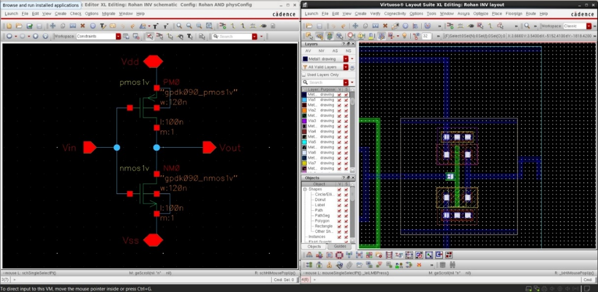

#### OR Gate  
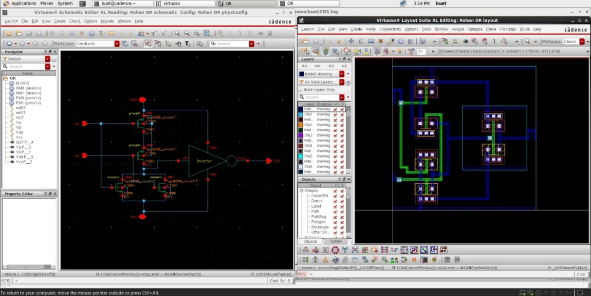

---

### Arithmetic Circuits

#### XOR Gate  
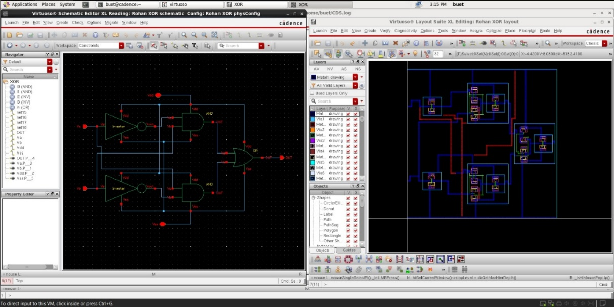

#### Full Adder  
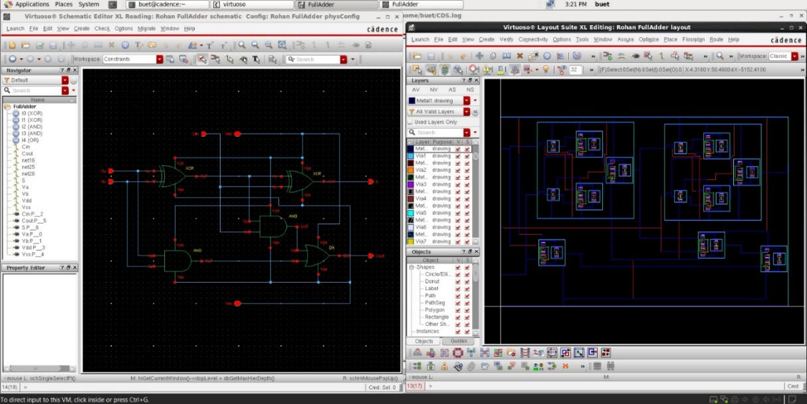

#### Full Subtractor  
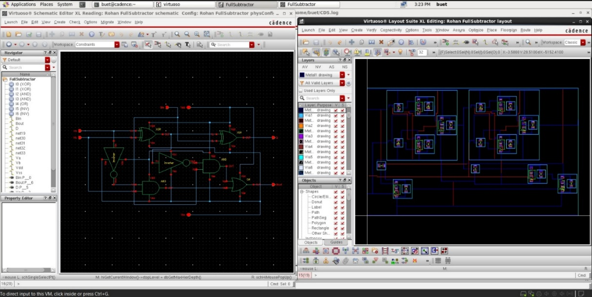

---

### Shift Unit

#### D Flip-Flop  
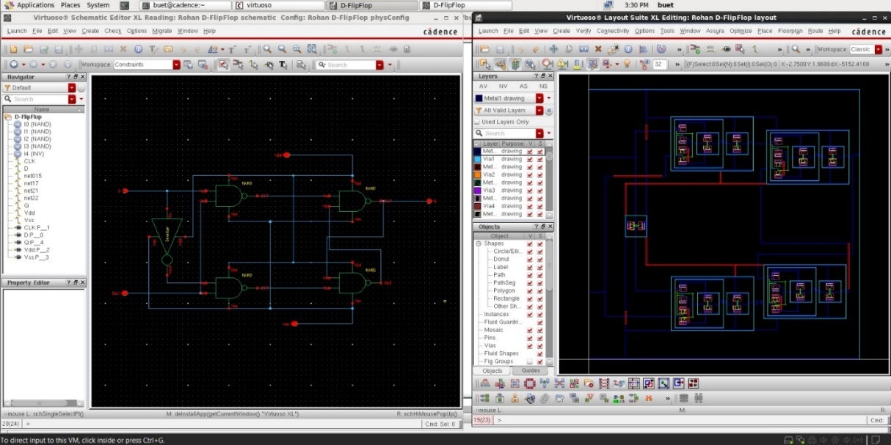

---

### Multiplexers

#### 2×1 Multiplexer  
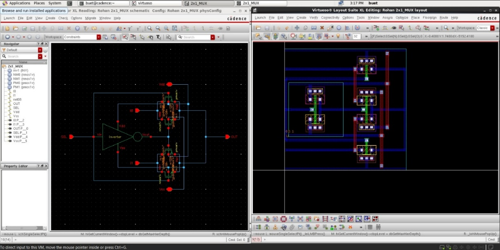

#### 8×1 Multiplexer  
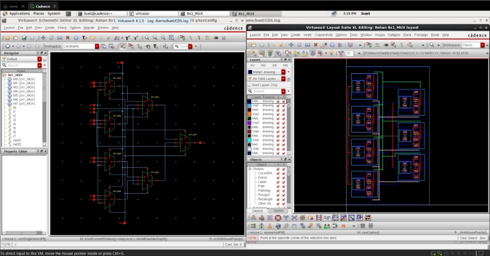

---

### Hierarchical ALU Design

#### 1-Bit ALU  
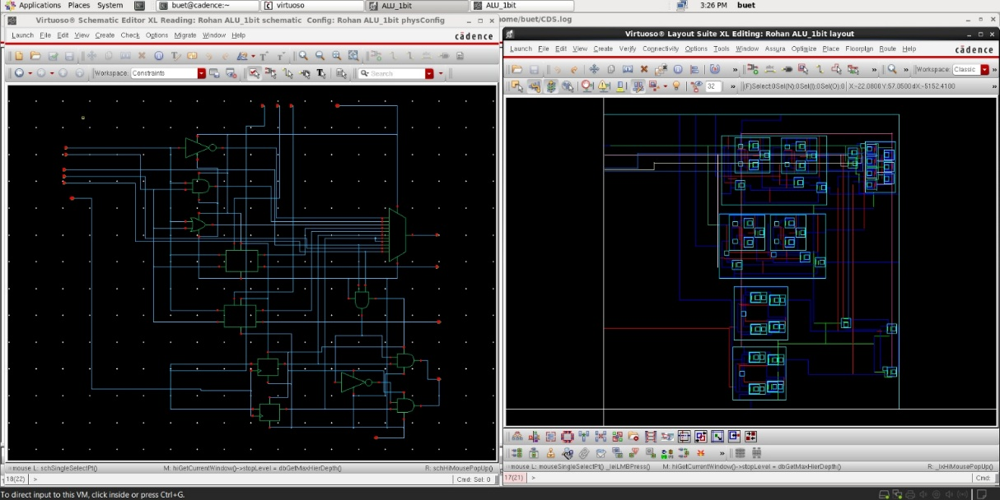

#### 2-Bit ALU  

#### 4-Bit ALU  

#### 16-Bit ALU  
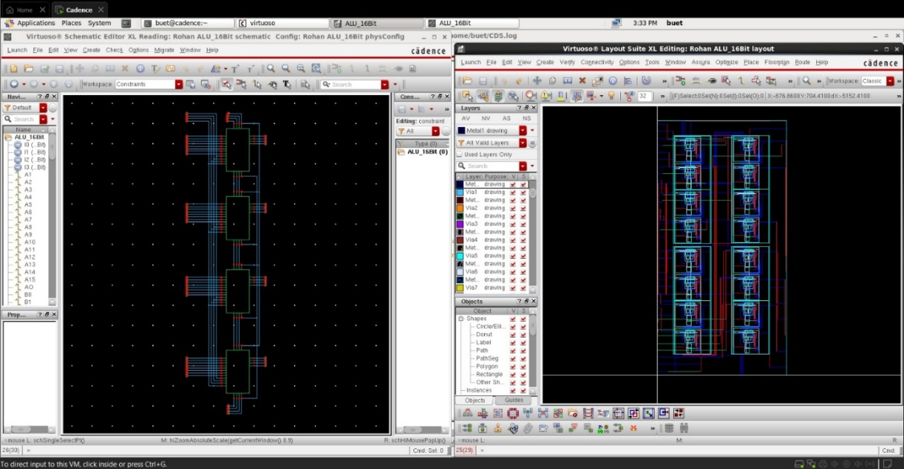

#### 32-Bit ALU (Final)  

---

## 🔷 32-Bit Symbol View

A clean symbol view was created to integrate the ALU at higher hierarchy levels.

### 32-Bit ALU Symbol  
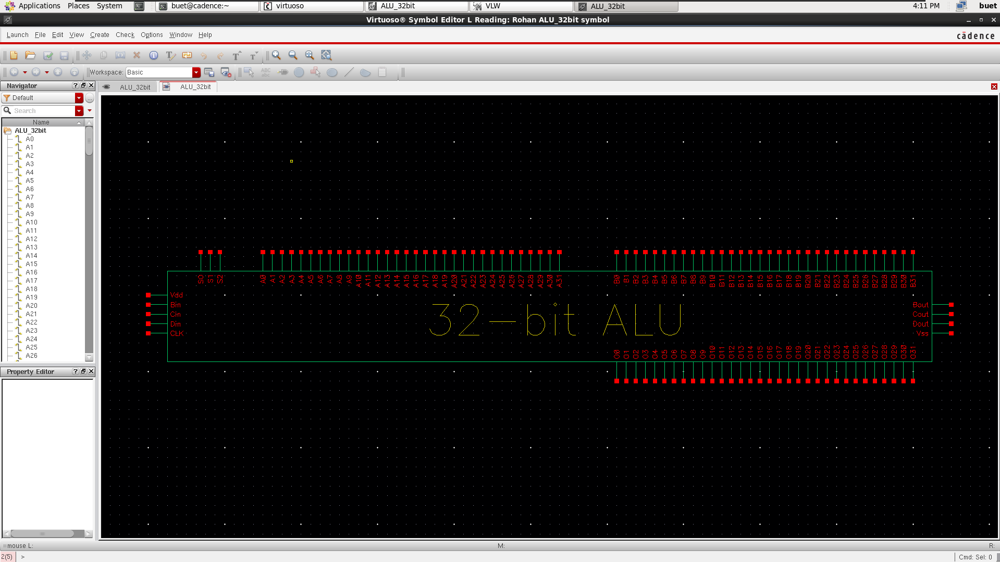

---

## 📊 Results & Discussion

- All arithmetic, logical, and shift operations were validated through transient simulations.  
- The 8×1 multiplexer reliably handled operation selection.  
- Scaling from 1-bit to 32-bit maintained correctness and stable carry propagation.  
- Output waveforms matched the expected behaviour.

---

## ✔️ Layout Verification

### 🟩 DRC Results (Design Rule Check)

- Technology: **gpdk90 90 nm**
- All layout rules satisfied  
- No spacing, width, enclosure, or density violations  

**DRC Status:**  
-Total Errors: 0
-Status: PASS

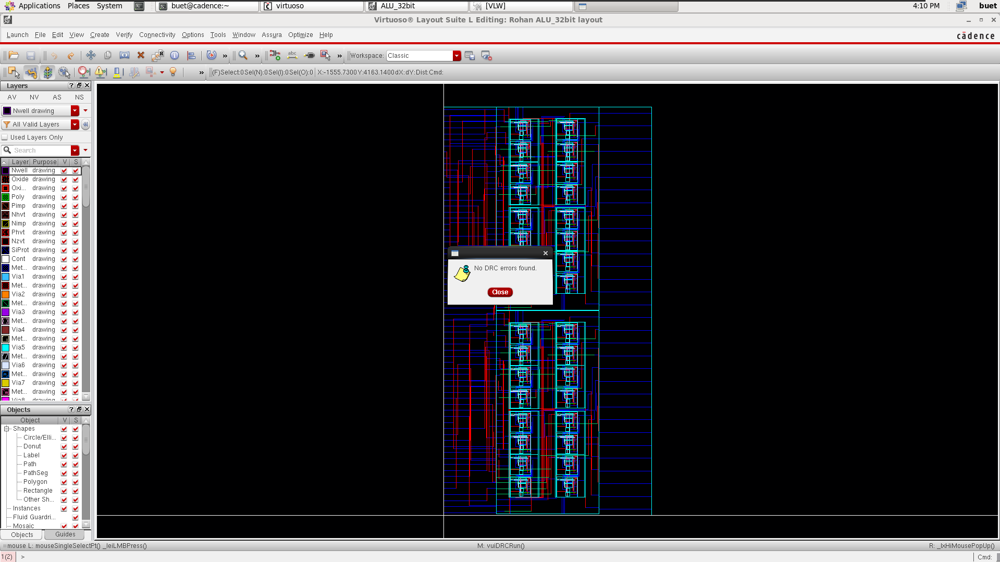

---

### 🟦 LVS Results (Layout vs. Schematic)

- Layout matches schematic  
- No missing devices  
- No shorts or opens  
- No parameter mismatches  

**LVS Status:**  
-Netlist Comparison: MATCH
-Device Count: MATCH
-Status: PASS

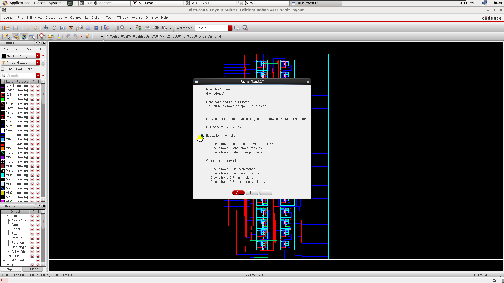

---

## 📚 References

1. Manur, M. S. *Design of 32-bit Low Power ALU Using Cadence.* GIJET, 2017.  
2. Shohail, K. I., et al. *Design Steps Simulation and Analysis of a 1-bit ALU in Cadence at 90 nm CMOS Node.* IOSR-JVSP, 2023.
